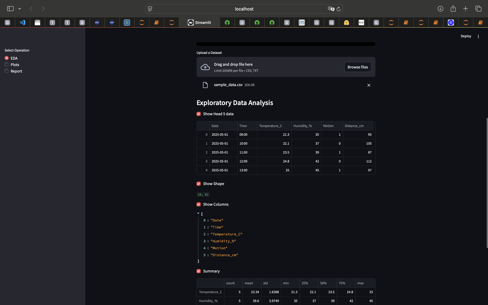

# StatFlow – Smart EDA App


## Overview

**StatFlow** is a user-friendly, interactive Streamlit app for automated and visual exploratory data analysis (EDA). Effortlessly upload your dataset (CSV/TXT), visualize insights, generate custom plots, and produce in-depth profiling reports – all from your browser!



---

## Features

- **Upload any CSV or TXT dataset**
- **Automated Exploratory Data Analysis**  
  - View data head, shape, columns, and summary stats  
  - Calculate confidence intervals
  - Value counts & correlation heatmaps
  - Pie charts and more
- **Custom Data Visualizations**  
  - Area, Bar, Line, Histogram, Box, KDE plots
- **Automated EDA Reports**  
  - Profile your data with [ydata-profiling](https://github.com/ydataai/ydata-profiling)
  - Detailed, exportable reports

---

## Quick Start

1. **Clone this repository:**
   ```bash
   git clone https://github.com/tahmid-al/statflow.git
   cd statflow
   ```

2. **Install dependencies:**
   ```bash
   pip install -r requirements.txt
   # Or use conda: conda env create -f environment.yml
   ```

3. **Run the app:**
   ```bash
   streamlit run app.py
   ```

4. **Open your browser:**  
   Navigate to `http://localhost:8501` to interact with StatFlow.

---

## Directory Structure

```
statflow/
│
├── app.py                   # Main Streamlit application
├── requirements.txt         # Python dependencies
├── LICENSE
├── README.md
├── images/
│   └── StatFlow_screenshot.png   # App screenshots
├── notebooks/               # Jupyter notebooks for research/EDA
├── research/                # Reports, literature review, etc.
├── data/                    # (Optional) Sample datasets
```

---

## Dependencies

- **Python 3.10+**
- Streamlit
- pandas, numpy, matplotlib, seaborn
- ydata-profiling
- Pillow

See `requirements.txt` for the full list.

---

## License

This project is licensed under the [MIT License](LICENSE).

---

## Credits

Developed by [Your Name or Team].  
Inspired by modern EDA tools and the need for rapid data insights!

---

## Contributing

Pull requests are welcome! For major changes, please open an issue first to discuss your ideas.

---

## Example


---
